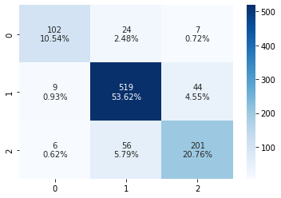
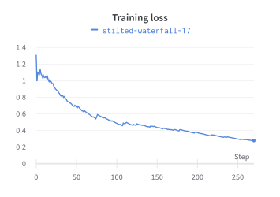

# Sentiment analysis with BERT

TODO:

- TBD manual labeling
- Evaluation metrics
- Performance metrics
- Vizualization

## What is BERT model

BERT is a language model developed by Google in 2019 and instead of pre-learning words, this model has pre-learned entire sentences. Training is done on a huge corpus gathered from Wikipedia and books ad it self-suprevised. In this example well use Python library *simpletransformes* which is a wrapping librarry around Transformers library by Hugging Face.

### Text preprocessing and tokenization

BERT comes with pretrained tokenization and preprocessing. Most notable cases for our case would be:

- Stemming or lemmatization: BERT uses byte pair encoding, that encodes words like *standing* like **stand** + **##ind**, because this information is needed for some NLP tasks, therefore there is no need for us to do it by ourselfs
- Decapitalization: in our case we need to know the difference between *US* and *us*, so the decapitalization should not be performed. Fortunately BERT provides cased and uncased models, for our purposes we picked "bert-base-cased"
- Removing stop words and high-frequency words: BERT uses Transformers model, and it should not affect the result. Our testing did confirn that, accuracy of predictions only icreased by >3%.

### Training and evaluation

In the *simpletransformers* library training a model is as simple as passing our data model to `model.train_model`. As it is metioned before, it applies the appropriate tokenization and trains our model.

Training and evaluation is done on the Financial Phrase Bank dataset, where the split is 60 % for train, 20 % for evaluation and 20 % for testing purposes. Time average for three run was 5:34 for training phase and time for evaluation and testing was negligible (training was done with Google Colab with GPU acceleration). This time with combination with ease of deployment makes *simpletransformers* a very powerfull tool in sentiment analysis.

## Results

For tweaking the model and its parametrs we used `sklearn.metrics` module as main information for this.

> Accuracy score computes subset accuracy: the set of labels predicted for a sample must exactly math the corresponding se of labels
>
>Accuracy Score - 0.8491735537190083

> F1 Score is calculated form the precision and recall of the test: F1 = 2 * (precision * recall) / (precision + recall)
>
> F1 Score -  0.8491735537190083

## References

- Data: <https://towardsdatascience.com/sentiment-analysis-in-10-minutes-with-bert-and-hugging-face-294e8a04b671>
- BERT in ten minits: <https://towardsdatascience.com/sentiment-analysis-in-10-minutes-with-bert-and-hugging-face-294e8a04b671>
- Code source:
  - <https://www.kaggle.com/code/kamalkhumar/financial-news-analysis-using-bert-with-eda>
  - <https://www.kaggle.com/code/adarshbiradar/sentiment-analysis-using-bert>
